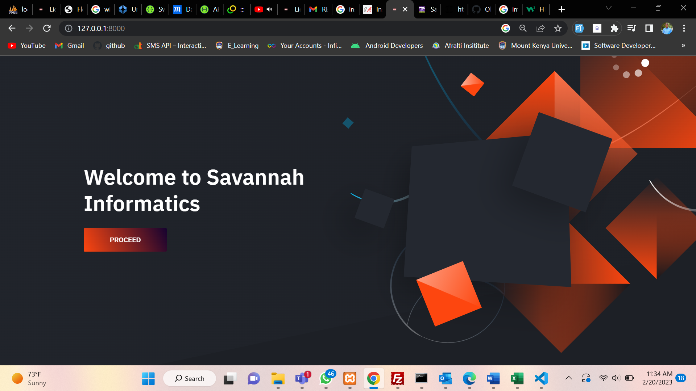

## Savannah Informatics Demo Test

Option 1: Candidates can build an application that consumes data from
https://jsonplaceholder.typicode.com/

##How to run
update composer 
create a database called savannah 
run 'php artisan migrate'  
php artisan serve

